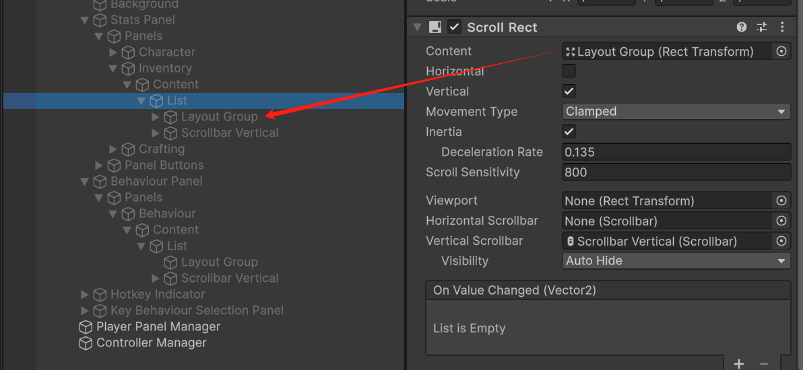

# Scroll Rect

Scroll Rect限制Content在Scroll Rect的显示内容，并通过Scroll Bar调节显示范围。

Content的元素大小如果小于Scroll Rect的元素大小就不会发生滚动。因此一般为Content添加Content Size Fitter根据子元素内容动态调整宽高。

同时为了避免Content的元素溢出到Scroll Rect外部，需要在合适的父元素添加Mask来屏蔽超出父元素的内容。