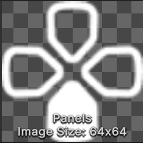
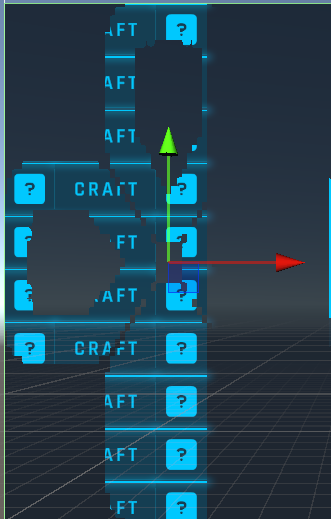

# 20240627

### TODO: 
- ~~**Panel switch**~~
- ~~**Behaviour Panel**~~
- ~~**Behaviour Item**~~

### Recap
### **[Mask](https://docs.unity3d.com/Packages/com.unity.ugui@2.0/manual/script-Mask.html)** 
Mask限制子元素的显示不会超过父元素。Mask会根据当前元素的Image来判断显示范围。例如如果Mask的Image如下：

遮罩效果如下（大致意思就是这样，右侧没有形成图像是因为右侧没有图像）：

一般来说Image使用None，白色即可，用于Scroll Rect场景。

